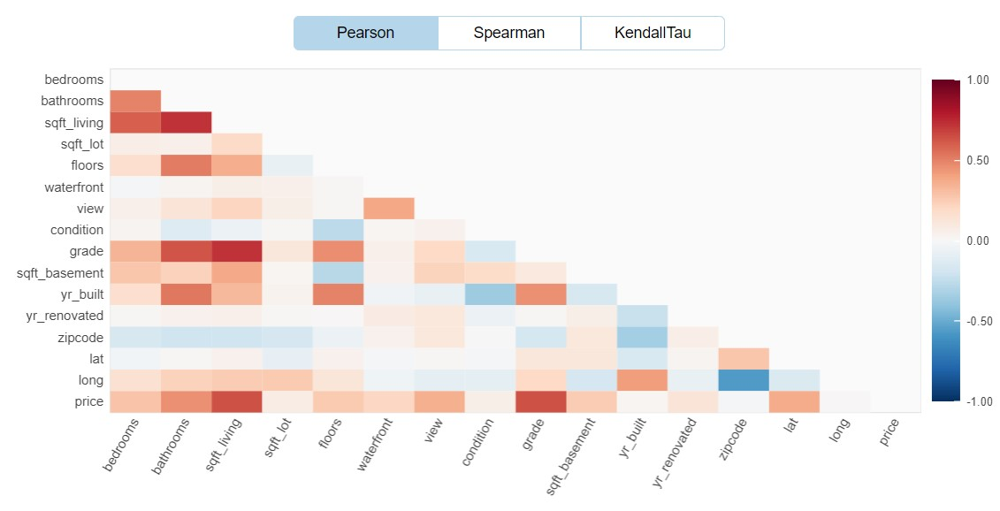
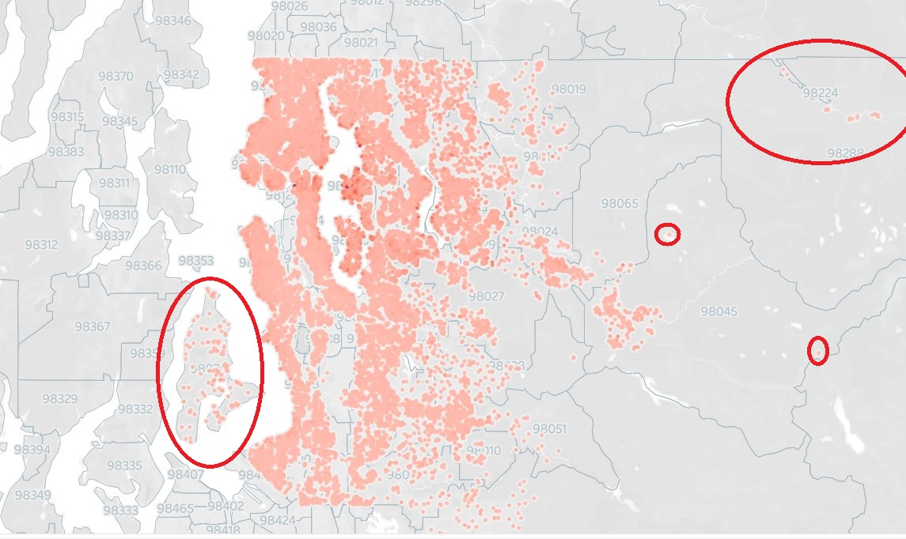
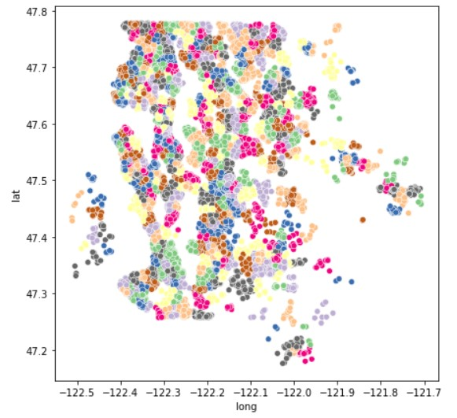

# Housing Price Prediction
  

## Introduction
In this project, we look at housing price data from approx. 21,400 properties from King County in the state of Washington, USA. The data describes properties which were sold in a one-month period in 2015. The dataset is from [Kaggle](https://www.kaggle.com/code/madislemsalu/predicting-housing-prices-in-king-county-usa).

#### Defining the problem
In this imaginary scenario, the client is a real estate agency in the Seattle area. The agency wishes to predict housing prices with a high level of accuracy. The agency is convinced that there is a linear relationship between the features in the dataset and the housing prices, therefore we will only concentrate on finding a Linear Model. 

#### Tools
The primary libraries used include:
- for Exploratory Data Analysis (EDA): Fast ML, Sweetviz, Dataprep and Matplotlib
- for ML: Scikit-Learn, Fast ML
    
#### Steps

The following steps were undertaken to find the model:
- Exploratory Data Analysis (EDA)
- Creation of a baseline model
- Feature Engineering and Selection
- Gridsearch

Below, we provide additional information about the individual steps.

### Exploratory Data Analysis
After importing the data, EDA was conducted using EDA libraries including Sweetviz and Dataprep as well as by plotting data with Matplotlib and on a map in Tableau.
The dataset is composed of 21 columns. Two columns, 'id' and 'date', were quickly dropped as their lack of relevance to estimating the price was clear.
Some other learnings from EDA included:
- no missing data.
- the column 'yr_renovated' either contains zeros or the year in which the house was renovated and would likely benefit from binning.
- the dataset includes statistical as well as geographic outliers.
- some features such as 'grade' and 'view' are ordinal values - they can thus be treated as either numerical or categorical.
- some features such as 'sqr. ft living' and 'sqr. ft above' are highly correlated with each other, it is likely one can be dropped. 
- the various square footage features and 'grade' appear to be most highly correlated with price.

To obtain some industry knowledge, a brief internet research was conducted which revealed that the following can impact real estate price:  
- Prices of comparable properties
- Age and condition
- Property size / usable space
- Neighborhood / location (crime rate, schools, view, parking availability...)
- Upgrades

### Creation of a baseline model
A baseline vanilla Linear Regression model was created with Scikit Learn. In addition, some data preparation and testing functions were created to facilitate testing. These also included functions for cross validation on the training data and for testing on validation and test sets.
The initial model using the raw data (minus the 'id' and 'date' columns) indicated an R2 of approx. 0.7 with an MAE of over $120,000.

### Feature Engineering and Selection
The Feature Engineering and Selection steps included:
    - Outlier removal
    - Encoding / transformation of geospatial information (zip codes and latitude and longitude)
    - Feature removal
    - Binning

__Outlier Removal__  
Since the model should be able to forecast the price for a variety of properties but at the same time maintain good accuracy, it was deemed a good idea to remove at least some outliers. Since there were no outliers towards the bottom, the question was how to set the caps. 3 methods were used for determining caps, including:
- 3 standard deviations above the mean
- 95th percentile
- 99th percentile

Using the 99th percentile as a cap yielded the smallest number of outliers, but nonetheless yielded an immediate improvement in MAE of around 10%.

In addition, some geographic outliers were located using the Tableau map. It was decided to drop properties East of -121.7 degrees longitude, as these properties were located in geographically remote areas and in very different circumstances as the main data set, with a median value below the dataset median. 

It was also considered whether or not to remove approx. 115 properties located on two islands (Vashon and Maury Island) only accessible by ferry. However, since the median value of these properties was slightly above the dataset median, they would presumably of interest to our client, so it was decided to keep them in the dataset. 

__Encoding / Transformation of Geospatial Information__  
Since zip code areas are large and not necesarily very homogenous areas, it seemed sensible to experiment with smaller geographic units. As a result, KMeans was used to cluster the properties according to latitudinal and longitudinal coordinates. 
Some initial experiments showed that models with one-hot-encoded KMeans clusters outperformed models with encoded zip codes. Subsequently, a function was used to loop through different numbers of clusters to determine which yielded the best model performance. Performance from models between 500 - 600 clusters was practically even and yielded the best results. Since each additional cluster requires additional computations, it was decided to move forward with 500 clusters. 

__Removing features__  
A series of tests was done to train and test models after removing features which were very similar to or highly correlated with other features. As a result, three features ('sqft_living15', 'sqft_lot15' and 'sqft_above') were removed. This resulted in practically even model performance.

__Binning__  
Do to the fact that the column 'yr_renovated' had the problem with 0 values, and 'yr_built' did not have a clear linear relationship with price, it seemed that both would be good candidates for binning. 'yr_built' was binned according to time periods which got larger the further back they went in time, to allow for a more or less even distribution. 

'yr_renovated' was binned in a similar fashion (bins: 'very recent', 'recent', 'distant', 'not relevant'), where properties with 0 values were placed in the bin 'not relevant'. >95% of samples were in this latter bin, and plotting the bins did not show a easily explained relationship between bin and price. Nonetheless, the performance of the model improved slightly. 

Since the benefits of a renovation also seemed likely to be tied to property age, an experiment was done to combine the 'yr_renovated' and 'yr_built' bins, but this did not yield any improvements in model performance.

__Test different combinations of categorical variables__  
In this step, we looked at all features ('grade', 'bedrooms', 'bathrooms','view', 'floors', 'condition') which could potentially be treated as either numerical or categorical variables (requiring one-hot-encoding). A function was created to create a list of all possible combinations and then to train and test models for each combination. This revealed that model performance was best when all or almost all of the examined variables were treated as categorical variables. As a result, it was decided that only 'condition', 'sqft_basement', 'sqft_living', and 'sqft_lot' would remain as numerical variables.

__Grid Search__  
In this final step, we examined whether the Linear Regression model we had been using could be outperformed by Lasso or ElasticNet. The Gridsearch also included different scalers (Standardizer, MinMaxScaler, RobustScaler) to be applied on the numeric variables and various hyperparameters. The winning model of the Grid Search, which included cross validation, was a Lasso model with alpha 7.5 combined with a MinMaxScaler. However, the performance was only trifilingly better than that of the regular Linear Regression model.

### Conclusion
Due to the fact that the Linear Regression model was computationally less expensive, performed almost evenly in cross-validation, and performed better on the test set, it was chosen over the Lasso model.

The final model's adjusted R2 score was 85.3 with an MAE of $69,751. This represents a significant improvement over the baseline model. Nonetheless, it must be admitted that the MAE is still very high and may render the model less useful for predicting house prices. The next step would be to try non-linear models like Random Forest or XGBoost. 

For me personally, the project was highly useful as I learned to work with several new tools and methods, including Scikit-Learn's pipelines and Grid Search. I also learned the utility of creating testing- and scoring functions which can significantly accelerate the testing process.

Thanks for reading! In case of any questions, please drop me a line at arne.thielenhaus@gmail.com.

### Sources:
- Insights regarding housing prices: https://www.opendoor.com/articles/factors-that-influence-home-value
- more insights regarding housing prices: https://www.experian.com/blogs/ask-experian/factors-that-affect-home-value/
- photo of houses: https://www.gpsmycity.com/discovery/queen-anne-sightseeing-walk-165.html    
