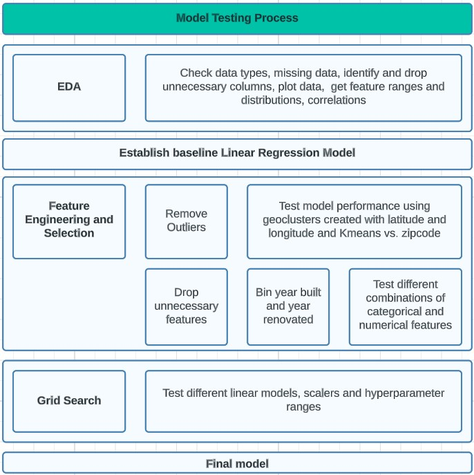
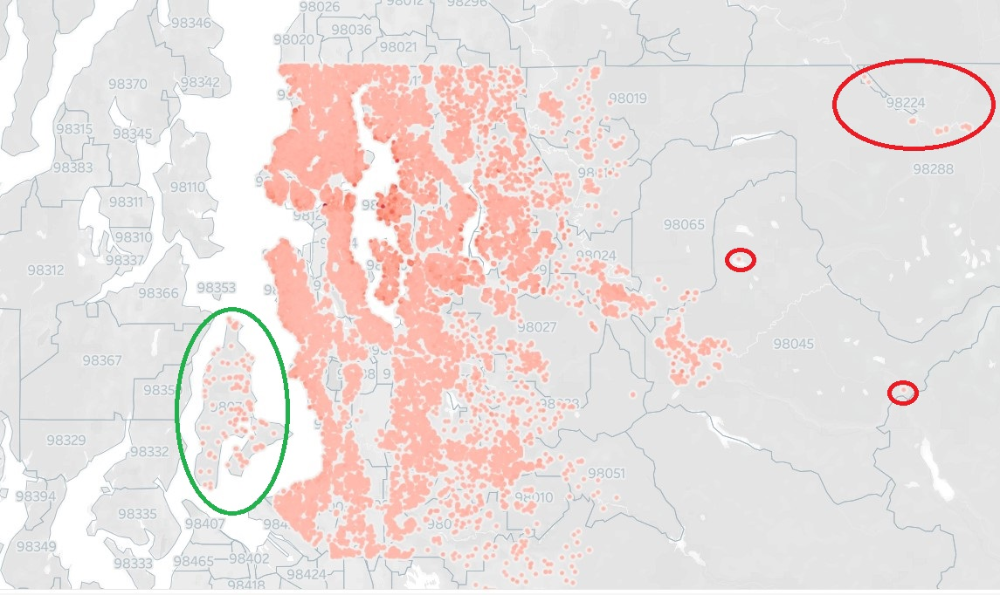
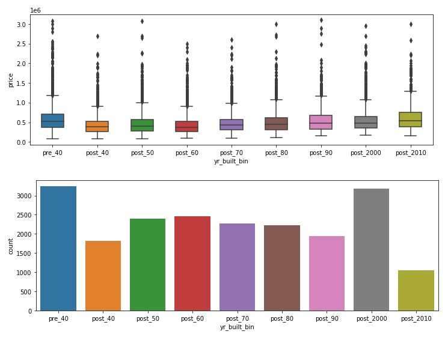

# Predicting Housing Prices in King County
  

## Introduction
In this project, the focus was housing price data from approx. 21,600 properties from King County in the state of Washington, USA. The data describes properties which were sold in a one-month period in 2015. The dataset is from [Kaggle](https://www.kaggle.com/code/madislemsalu/predicting-housing-prices-in-king-county-usa).

#### Defining the problem
In this imaginary scenario, the client is a real estate agency in the Seattle area. The agency wishes to predict housing prices with a high level of accuracy. The agency is convinced that there is a linear relationship between the features in the dataset and the housing prices, therefore we will only concentrate on finding a Linear Model. 

#### Tools
The primary libraries used include:
- for Exploratory Data Analysis (EDA): Fast ML, Sweetviz, Dataprep and Matplotlib
- for ML: Scikit-Learn, Fast ML
    
#### Steps

The following steps were undertaken to find the model:  
- Exploratory Data Analysis (EDA)
- Creation of a baseline model
- Feature Engineering and Selection
- Grid Search

The Feature Engineering and Selection as well as the Grid Search steps were accompanied by continuous testing. Below, we provide additional information about the individual steps.

### Exploratory Data Analysis
After importing the data, EDA was conducted using EDA libraries including Sweetviz and Dataprep as well as by plotting data with Matplotlib and on a map in Tableau.
The dataset is composed of 21 columns. Two columns, 'id' and 'date', were quickly dropped as their lack of relevance to estimating the price was clear.
Some other learnings from EDA included:
- no missing data.
- the column 'yr_renovated' either contains zeros or the year in which the house was renovated and would likely benefit from binning.
- the dataset includes statistical as well as geographic outliers.
- some features such as 'grade' and 'view' are ordinal values - they can thus be treated as either numerical or categorical.
- some features such as 'sqr. ft living' and 'sqr. ft above' are highly correlated with each other, it is likely one can be dropped. 
- the various square footage features and 'grade' appear to be most highly correlated with price.

To obtain some industry knowledge, a brief internet research was conducted which revealed that the following can impact real estate price:  
- Prices of comparable properties
- Age and condition
- Property size / usable space
- Neighborhood / location (crime rate, schools, view, parking availability...)
- Upgrades

### Creation of a baseline model
A baseline vanilla Linear Regression model was created with Scikit Learn. In addition, some data preparation and testing functions were created to facilitate testing. These also included functions for cross validation on the training data and for testing on validation and test sets. The split applied to the dataset consisted of 70% for training, 20% for validation and 10% for testing.

The initial model using the raw data (minus the 'id' and 'date' columns) indicated an R2 of approx. 0.7 with an MAE of over $120,000.

### Feature Engineering and Selection
The Feature Engineering and Selection steps included:
- Outlier removal  
- Encoding / transformation of geospatial information (zip codes and latitude and longitude)  
- Feature removal  
- Binning  
- Testing of different combinations of categorical and numerical features

The following sections contain more information about the individual feature engineering and selection steps.  

__Outlier Removal__  
Since the model should be able to forecast the price for a variety of properties but at the same time maintain good accuracy, it was deemed a good idea to remove at least some outliers. Since there were no outliers towards the bottom, the question was how to set the caps. 3 different methods were tested for determining cap placement, including:
- 3 standard deviations above the mean
- 95th percentile
- 99th percentile

Using the 99th percentile as a cap yielded the smallest number of outliers, but nonetheless yielded an immediate improvement in MAE of around 10%. It was therefore decided to use this method for setting the cap. This reduced the number of samples to 20,639, so by approximately 4.4%.

In addition, some geographic outliers were located using the Tableau map. It was decided to drop properties East of -121.7 degrees longitude, as these properties were located in geographically remote areas and in very different circumstances as the main data set, with a median value below the dataset median. This reduced the dataset by an additional 22 samples.

It was also considered whether or not to remove approx. 115 properties located on two islands (Vashon and Maury Island) only accessible by ferry. However, since the median value of these properties was slightly above the dataset median, they would presumably of interest to our client, so it was decided to keep them in the dataset.  

__Encoding / Transformation of Geospatial Information__  
In an initial step, a performance comparison was made between one-hot-encoding and frequency encoding the zip code feature. One-hot-encoding emerged as a clear winner, leading to a significant performance boost and indicating that there is a strong relationship between location and price. However, since zip code areas are large and not necesarily very homogenous areas, it seemed sensible to experiment with smaller geographic units. For this purpose, KMeans was used to cluster the properties according to their latitudinal and longitudinal coordinates. 
Initial experiments showed that models with one-hot-encoded KMeans clusters outperformed models with encoded zip codes. Subsequently, a function was used to loop through different numbers of clusters to determine which yielded the best model performance. Performance from models between 500 - 600 clusters was practically even and yielded the best results. Since each additional cluster requires additional computations, it was decided to move forward with 500 clusters.  

__Removing features__  
A series of tests was done to train and test models after removing features which appeared to be very similar to / highly correlated with other features. As a result, three features ('sqft_living15', 'sqft_lot15' and 'sqft_above') were removed. This resulted in practically even model performance.

__Binning__  
Due to the fact that the column 'yr_renovated' had the problem with 0 values, and 'yr_built' did not have a clear linear relationship with price, it seemed that both could be good candidates for binning. For 'yr_built', model performance was tested with different bin sizes. This revealed that properties built in the 1940s had the lowest values, while those after were sold at higher prices which increased as the yr_built approached present day. Properties built before 1940 (presumably considered "historic") also had higher values. Some internet research revealed that houses built from 1890-1910 were often built in a style that was particularly popular ("Queen Anne Style"), and while the data does not contain information about design, properties from these decades tended to have higher prices. Experimentation showed that the model experienced the greatest (albeit still modest) performance boost when binning was done according to decades, plus one bin including all properties built prior to 1940 and one including properties built between 2010 and 2015. 

'yr_renovated' was binned in a similar fashion (bins: 'very recent', 'recent', 'distant', 'not relevant'), where properties with 0 values were placed in the 'not relevant' bin. Since >95% of samples had not undergone renovation and thus were assigned to the 'not relevant' bin, there was no possibility of ensuring an even distribution among the bins. Nonetheless, the performance of the model improved slightly. 

Since the benefits of a renovation also seemed likely to be tied to property age, an experiment was done to combine the 'yr_renovated' and 'yr_built' bins, but this did not yield any improvements in model performance.

__Test different combinations of categorical variables__  
This step examined all features ('grade', 'bedrooms', 'bathrooms','view', 'floors', 'condition') which could potentially be treated as either numerical or categorical variables (requiring one-hot-encoding). A function was created to create a list of all possible combinations and then to train and test models for each combination. This revealed that model performance was best when all or almost all of the examined variables were treated as categorical variables. As a result, it was decided that only 'condition', 'sqft_basement', 'sqft_living', and 'sqft_lot' would remain as numerical variables.

__Grid Search__  
In this final step, it was examined whether the Linear Regression model that was being used could be outperformed by Lasso or ElasticNet. The grid search also included different scalers (Standardizer, MinMaxScaler, RobustScaler) to be applied on the numeric variables, as well as various hyperparameters. The winning model of the grid search, which included cross validation, was a Lasso model with alpha 7.5 combined with a MinMaxScaler. However, the performance was only trifilingly better than that of the regular Linear Regression model.

### Conclusion
Due to the fact that the Linear Regression model was computationally less expensive, performed almost evenly in cross-validation, and performed better on the test set, it was chosen over the Lasso model.

The final model's adjusted R2 score on the test set was 85.3 with an MAE of $69,745. This represents a significant improvement over the baseline model. Nonetheless, it must be admitted that the MAE is still very high and may render the model less useful for predicting house prices. Next steps could include:  
- try non-linear models like Random Forest or XGBoost
- enrich the dataset with additional data (ex: information about nearby schools, crime statistics, etc.)
- create seperate models for different segments (ex: for high-value homes), as the relationships between independent and dependent variables could be different.

For me personally, the project was highly useful as I learned to work with several new tools and methods, including Scikit-Learn's pipelines and Grid Search. I also learned the utility of creating testing- and scoring functions which can significantly accelerate the testing process.

Thanks for reading! In case of any questions, please drop me a line at arne.thielenhaus@gmail.com.

### Sources:
- Insights regarding housing prices:
    - https://www.opendoor.com/articles/factors-that-influence-home-value
    - https://www.experian.com/blogs/ask-experian/factors-that-affect-home-value/
- photo of houses: https://www.gpsmycity.com/discovery/queen-anne-sightseeing-walk-165.html
- Queen Anne style architecture: https://en.wikipedia.org/wiki/Queen_Anne_style_architecture_in_the_United_States    
